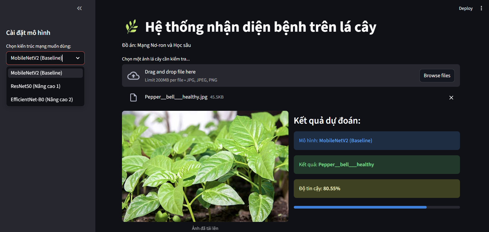

# 🌿 PlantVillage-Lens: Multi-Model Leaf Disease Classification

[](https://www.python.org/)
[](https://pytorch.org/)
[](https://streamlit.io/)

## 📝 Giới thiệu dự án
Dự án này tập trung vào việc nghiên cứu và xây dựng hệ thống nhận diện tự động 15 loại bệnh lý trên lá của ba nhóm cây trồng chủ lực: **Cà chua, Khoai tây và Ớt chuông**. Bằng cách ứng dụng các kiến trúc mạng nơ-ron tích chập (CNN) tiên tiến, hệ thống hỗ trợ chẩn đoán nhanh chóng và chính xác tình trạng sức khỏe cây trồng, góp phần tối ưu hóa quy trình bảo vệ thực vật trong nông nghiệp 4.0.

## 🚀 Tính năng nổi bật
- **Đa mô hình (Multi-Model Support):** Tích hợp đồng thời 3 kiến trúc: MobileNetV2, ResNet50 và EfficientNet-B0.
- **Độ chính xác cao:** Đạt ngưỡng Accuracy và F1-Score trên **99%** sau 20 epoch huấn luyện.
- **Giao diện trực quan:** Web App xây dựng bằng Streamlit, cho phép upload ảnh và so sánh kết quả dự đoán thời gian thực giữa các mô hình.
- **Phân tích thực địa:** Đã được kiểm chứng với hiện tượng "Domain Gap" trên các mẫu ảnh chụp thực tế ngoài vườn cây.

## 📊 Kết quả thực nghiệm (20 Epochs)

Dưới đây là bảng so sánh hiệu năng giữa 3 mô hình trên tập kiểm tra (Test Set):

| Model Architecture | Accuracy | F1-Score | Parameter count |
| :--- | :---: | :---: | :---: |
| **MobileNetV2** (Baseline) | 99.55% | 99.55% | ~2.2M |
| **ResNet50** (Advanced) | 99.45% | 99.45% | ~23.5M |
| **EfficientNet-B0** (State-of-the-art) | **99.55%** | **99.55%** | **~4.0M** |

*Nhận xét: EfficientNet-B0 cho kết quả ổn định nhất về mặt trích xuất đặc trưng trên dữ liệu thực tế.*

## 📂 Cấu trúc thư mục
```text
├── models/                 # Chứa các trọng số đã huấn luyện (.pth)
├── notebooks/              # File Google Colab huấn luyện chi tiết
├── docs/                   # Báo cáo PDF và Slide thuyết trình
├── app.py                  # Mã nguồn giao diện Streamlit
├── requirements.txt        # Danh sách thư viện cần cài đặt
└── README.md               # Giới thiệu dự án
```

## 🛠 Hướng dẫn cài đặt và sử dụng
1. Yêu cầu hệ thống
Python 3.8+
RAM: Tối thiểu 4GB
Internet (để tải thư viện và pretrained weights ban đầu)
2. Các bước cài đặt

``bash
#Clone repository này
git clone https://github.com/your-username/your-repo-name.git
cd your-repo-name
#Cài đặt các thư viện cần thiết
pip install -r requirements.txt
``
3. Chạy ứng dụng
``
streamlit run app.py
``
## 🧠 Chiến lược huấn luyện
Dự án áp dụng kỹ thuật Transfer Learning kết hợp với Fine-tuning:
- Giai đoạn 1 (Epoch 1-5): Đóng băng (Freeze) lớp Backbone, chỉ huấn luyện lớp Classifier cuối cùng để ổn định mô hình.
- Giai đoạn 2 (Epoch 6-20): Mở băng (Unfreeze) toàn bộ mạng để tinh chỉnh sâu các đặc trưng hình thái vết bệnh, giúp tăng vọt độ chính xác từ 87% lên 99%.

## 📸 Demo Screenshots


## 🎓 Thành viên thực hiện
- Mai Phương Anh (Advanced Model & Evaluation)
- Tào Thanh Hà (Data Engineer & Baseline Model)
- Giảng viên hướng dẫn: Ts. Đặng Thị Thúy An

## 📜 Giấy phép
Dự án được thực hiện cho mục đích học thuật và nghiên cứu trong khuôn khổ học phần "Mạng nơ-ron và Học sâu".
